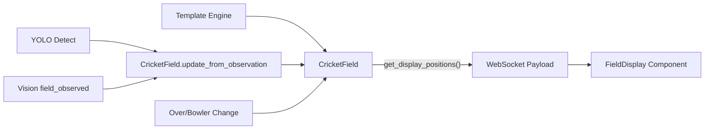

# Field Tracking V2 — Cricket-Logic-First

## Architecture




## Current State

- `FieldState` in `files/eyes/field/field_state.py` stores raw YOLO positions with zone names like `IC-cover`, `OC-deep_point`
- `FieldDetector` in `files/eyes/field/field_detector.py` does YOLO detection + zone classification
- `FieldMerger` in `files/eyes/field/field_merger.py` merges YOLO + vision observations
- Frontend `FieldMap.tsx` uses `ZONE_POSITIONS` to map zone names to coordinates, but shows only detected fielders (often 3-5 dots)
- The result: sparse, unreliable field display

## What Changes

### 1. New `CricketField` class — `files/eyes/field/cricket_field.py`

A new file implementing the spec's state machine. This does NOT replace `FieldState` — it wraps/supplements it as the source of truth for the UI.

- `**POSITIONS` dict**: 41 named positions with `(x, y)` coordinates from the spec
- **6 templates**: `PACE_POWERPLAY`, `PACE_MIDDLE`, `PACE_DEATH`, `SPIN_MIDDLE`, `SPIN_DEATH` (plus `SPIN_POWERPLAY` variant)
- `**CricketField` class** with:
  - `initialize_from_match_context(overs, bowler_type)` — select template
  - `update_from_observation(observed_positions)` — match YOLO (x,y) to nearest named positions, blend with current state, enforce rules
  - `_enforce_cricket_rules()` — always 9 fielders + keeper + bowler, powerplay circle limits
  - `on_over_change(new_overs, bowler_type)` — re-evaluate template on phase change
  - `on_bowler_change(new_bowler_type)` — adjust template for pace/spin
  - `get_display_positions()` — returns list of `{name, x, y, type, confidence}` for WS payload

### 2. Wire into pipeline — `files/test_pipeline.py`

- Import and instantiate `CricketField` alongside existing `field_state`
- After team detection, call `cricket_field.initialize_from_match_context(overs, bowler_type)` using the current bowler's role from squad data
- On each frame where `merged_field["source"] != "none"`: call `cricket_field.update_from_observation(yolo_positions)` with the raw (x,y) list
- On over change: call `cricket_field.on_over_change(new_overs, bowler_type)`
- On bowler change: call `cricket_field.on_bowler_change(new_bowler_type)`
- In `build_full_payload()`: replace the current field block with:

```python
"field": {
    "positions": cricket_field.get_display_positions(),
    "formation": cricket_field.template_name,
    "inside_count": cricket_field.inside_count,
    "outside_count": cricket_field.outside_count,
    "phase": cricket_field.phase,
    "confidence": cricket_field.confidence_label,
}
```

- Add striker/non_striker batter positions to the positions list

### 3. Update TypeScript types — `scorecard-ui/app/lib/types.ts`

Replace `FieldPosition` and `FieldData`:

```typescript
export interface FieldPosition {
  name: string;
  x: number;
  y: number;
  type: "wk" | "bowler" | "bat" | "close" | "in" | "out";
  confidence: number;
}

export interface FieldData {
  positions: FieldPosition[];
  formation?: string;
  inside_count?: number;
  outside_count?: number;
  phase?: string;
  confidence?: string;
}
```

### 4. New `FieldDisplay` component — `scorecard-ui/app/components/FieldMap.tsx`

Replace the existing component in-place with the spec's SVG-based approach:

- SVG `viewBox="0 0 100 100"` with boundary circle, 30-yard circle, pitch rectangle, crease lines
- Always render all positions from `field.positions` (guaranteed 11+ from backend)
- Color by `type`: wk=gold, bowler=gray, bat=red, close/in=blue, out=gray
- Size by type: bat largest, wk medium, fielders smallest
- Opacity from confidence
- Hover labels via `<title>` element
- Legend row below SVG
- "Field positions approximate" if confidence is "low"

### 5. Update `page.tsx` field tab

- Remove old `FieldMap` import (same file, new content)
- The field tab rendering stays the same (passes `state.field` to `FieldMap`)
- The old `keeper`, `depth`, `zone` fields in the payload are no longer needed — the new component uses `type`, `x`, `y`, `confidence`

## Files Modified

- **NEW**: `files/eyes/field/cricket_field.py`
- **EDIT**: `files/test_pipeline.py` — wire CricketField, update payload
- **EDIT**: `scorecard-ui/app/lib/types.ts` — new field types
- **REPLACE**: `scorecard-ui/app/components/FieldMap.tsx` — new SVG component
- **EDIT**: `scorecard-ui/app/page.tsx` — minor adjustments if needed

## Key Design Decisions

- **Keep existing `FieldState`/`FieldDetector`/`FieldMerger`** — they still provide YOLO observations. `CricketField` is a new layer that consumes their output and applies cricket logic
- **Templates are the baseline** — YOLO/vision observations only shift positions from template defaults, never reduce below 11 players
- **Bowler type inference**: use squad data `role` field (bowler/spinner) to select pace vs spin template. Default to pace if unknown.

## Bowler Type Lookup

`CricketField` needs to know if the current bowler is pace or spin to select the right template. A helper function in `cricket_field.py`:

```python
def get_bowler_type(bowler_name: str, squad_data: list[dict]) -> str:
    """Look up bowler type from squad data."""
    for player in squad_data:
        if player["name"] == bowler_name:
            role = player.get("role", "").lower()
            if any(x in role for x in ["spin", "slow", "orthodox"]):
                return "spin"
            return "pace"
    return "pace"  # default to pace if unknown
```

Called in `test_pipeline.py` at two points:

- **On initialization** (after team detection / innings setup):

```python
bowler_type = get_bowler_type(
    scoreboard.state.get("current_bowler"),
    bowling_squad
)
cricket_field.initialize_from_match_context(overs, bowler_type)
```

- **On bowler change** (when `current_bowler` updates):

```python
new_type = get_bowler_type(new_bowler_name, bowling_squad)
cricket_field.on_bowler_change(new_type)
```

`bowling_squad` is the raw squad list for the bowling team (already available in the pipeline as the parsed squad data).

