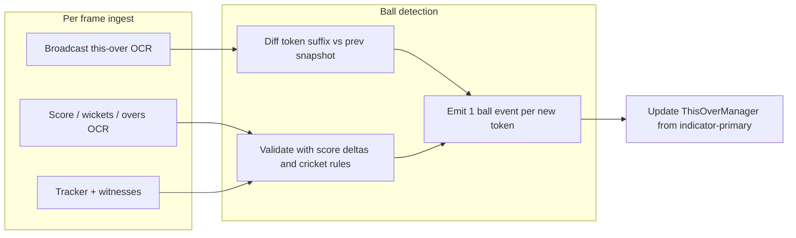

# This-over broadcast indicator as ground truth: architecture inversion (design memo)

**Status:** design / investigation-only — **no implementation** in this task.  
**Date:** 2026-05-01  
**Scope:** Largest of the parallel ball-event investigations. Complements Cause 4 (graphic filtering) and existing delta-based commentary stack.

---

## Executive summary

Today, **confirmed scoreboard deltas** (via `ConsistentReadTracker` + `BallEventDetector`) drive **when** balls exist and roughly **what** happened; the on-screen **this-over ribbon** (`this_over_broadcast`) is **parsed and stored** but **`ThisOverManager` treats locally observed tokens as primary** and only uses broadcast strips for **cold-start**, **gap-fill** (`?` placeholders after `MULTI_BALL`), and **strict reconciliation** gates.

This memo sketches **inverting** that priority: treat **stable OCR of the coloured ball-by-ball indicator** as the **canonical per-ball classifier**, and use **score / wickets / overs / strip witnesses** chiefly for **validation**, state anchoring, and recovery. **Empirical OCR reliability (Phase A3)** is the feasibility gate before heavy engineering.

---

## Phase A: Current architecture

### A1. Ball event flow (frame N → N+1)

The production path centres on **`BallEventDetector`** in `files/eyes/commentary.py`, which reads **`ConsistentReadTracker`** fields each frame (`score`, `wickets`, `overs`, striker/bowler card stats, optional broadcast EXTRA panel hints).

Rough sequence:

1. **Frame N:** tracker holds `score`, `wickets`, `overs`, etc. `BallEventDetector` has `prev_*` baselines from the prior committed state.
2. **Frame N+1:** tracker updates after scorer pipeline commits new readings.
3. **Delta calculation:** `_to_balls(overs)` yields legal-ball counts; `balls_delta`, `s_delta` (score), `w_delta` (wickets) drive classification (see ```157:727:files/eyes/commentary.py``` — `detect()`).
4. **Classification:**
   - `balls_delta == 1`: single legal-ball tick — wicket, dot, boundaries, `_N_RUNS`, leg-bye heuristic, or **EXTRA + queued legal** when fresh `broadcast_extra` (WD/NB) decomposes a combined signal.
   - `balls_delta == 0` and `s_delta > 0`: **EXTRA** (wide / no-ball) with evidence-aware `_method` tags and jitter deferral for phantom +1 (see commentary around ```543:677:files/eyes/commentary.py```).
   - `balls_delta > 1`: **`MULTI_BALL`** aggregate (`certain=False`) carrying `balls_missed` and `total_runs`.
   - Special branches: wicket without overs tick, `WICKET_LATE`, DRS rollback paths, `_balls_owed_to_silence` for overs catch-up after early wicket emission.
5. **Event emitted:** `ball_event` returned to **`test_pipeline`**, which calls **`ThisOverManager.on_ball_event`** to append **`obs`** tokens (`.` / `4` / `6` / `W` / `Wd`… / `MULTI_BALL` `?` placeholders) — see ```392:480:files/eyes/this_over.py``` (`_append_event_token`).
6. **`this_over` display:** **`over_mgr.get_display()`** is the preferred UI-facing ribbon; **`score_mgr.this_over`** is documented in-pipeline as **derived / secondary** to avoid flicker bugs (comments near ```4442:4478:files/test_pipeline.py```).

**Older / alternate detector:** `files/eyes/state/ball_detector.py` (`BallDetector`) uses simple score/wicket/overs deltas with wall-clock `min_gap` — not the rich path above; the commentary stack is authoritative for Machine 2–style behaviour.

### A2. Where the broadcast this-over indicator enters today

**Grep landmark:**  
`files/test_pipeline.py` — `this_over_broadcast`, `_parse_this_over_from_scout`, `extract_broadcast_data`, `on_broadcast_override`, `_validate_overs`.  
`files/eyes/this_over.py` — broadcast merge, score gate, recap rejection.  
`files/eyes/agent.py` — LLM JSON schema mentions `this_over_broadcast` for vision extractors.

| Question | Answer (code-backed) |
|----------|---------------------|
| **Is it parsed?** | Yes, from Scout **plain text**: `extract_broadcast_data()` calls `_parse_this_over_from_scout()` using regex `_THIS_OVER_RE` / `_THIS_OVER_TOKEN_RE` — ```1365:1496:files/test_pipeline.py```. |
| **What format?** | **`list[str]`** tokens (`".", "4", "wd", …`), lowercased/merged downstream in `ThisOverManager._merge_broadcast`. |
| **Where stored?** | Ephemeral **`_bcast`** dict per frame (`this_over_broadcast` key). **`ThisOverManager.this_over`** + **`this_over_sources`** persist UI state; broadcast contributions tagged **`bcast`**. |
| **Downstream consumers?** | (1) **`over_mgr.on_broadcast_override(...)`** — only when `frame_type == "SCOREBOARD"` (graphic frames discarded to avoid leaderboard pollution — ```6218:6233:files/test_pipeline.py```). (2) **`_validate_overs(..., broadcast_this_over=...)`** — uses token **count** to fix digit-swap / boundary misreads of **team overs** — ```1252:1341:files/test_pipeline.py```. |
| **`set_broadcast_extra` path** | `BallEventDetector.set_broadcast_extra` ingests WD/NB from strip/panel parsing — **extras classification**, not the ball circles themselves. |

**Reconciliation with delta-derived ribbon**

- **Primary append path:** **`on_ball_event`** after **`BallEventDetector.detect`** — ```9596:9613:files/test_pipeline.py```.
- **Broadcast path:** **`on_broadcast_override`** — **`never overwrites`** confirmed `obs` tokens; **fills `?`**; wholesale accept only cold-start or all-placeholder locals; **`MAX_THIS_OVER_LEN`** rejects multi-over recap strips; **score-gated** so strip cannot mutate between balls unless score advanced — ```520:691:files/eyes/this_over.py``` (+ module doc L1–4: “Local ball events are PRIMARY”).
- **`this_over_broadcast` from the LLM JSON is explicitly not applied twice:** comment at ```9518:9523:files/test_pipeline.py``` (regex path already called `on_broadcast_override`).

### A3. Reliability of the broadcast indicator (empirical protocol — **not executed in this memo**)

**Stop condition S1:** If a disciplined sample shows **indicator token accuracy `< 80%`** vs human labels (or vs an independent gold such as ESPN ball-by-ball for the same deliveries), treat **indicator-primary** as **blocked** until a dedicated OCR/classifier uplift lands.

**Suggested methodology (≈50 frames across ≥3 matches):**

1. **Stratified sample:** mix **SCOREBOARD** vs transitional frames, innings 1 vs 2, powerplay vs death, wickets, wides/no-balls, boundaries.
2. **Per frame, record:**
   - Raw Scout crop / snippet for “THIS OVER” region (if available) or saved `description` excerpt.
   - Parsed `this_over_broadcast`.
   - `over_mgr.this_over` **after** `on_ball_event` + merge (derived).
   - Committed **`score`, `wickets`, `overs`** from tracker.
3. **Metrics:**
   - **Readable:** non-null parse & `TOKEN-VALIDATE` pass vs reject (see `[TOKEN-VALIDATE]` / illegal speed-track digits in ```573:582:files/eyes/this_over.py```).
   - **Per-token accuracy** vs gold (exact string match after normalisation).
   - **Agreement rate** parsed broadcast vs **`obs`-only** reconstructed sequence where deltas unambiguously defined outcomes.
   - **Discrepancy rate:** frames where indicator and derived sequences **differ beyond merge rules** — bucket: OCR noise, recap strip (`> MAX_THIS_OVER_LEN`), graphic frame ignored, wicket/boundary ordering (see `reorder_wicket_to_ball` rationale — ```693:770:files/eyes/this_over.py```).

**Placeholder result for this document:** Metrics are **TBD**. No workspace batch run was performed as part of memo authorship. Completing A3 is **Phase 1** precondition work if S1 fires.

---

## Phase B: Inversion design

### B1. New flow sketch



**Conceptual pseudocode** (design level only):

```
state: prev_tokens[], committed_score, committed_overs, ...

on_frame(frame):
  tokens = normalize_ocr_this_over_strip(frame)   # authoritative candidate
  if tokens is unreadable_or_recap_strip:
      fall_back_to_legacy_delta_detector() ; return

  suffix = longest_common_prefix_diff(prev_tokens, tokens)
    # new balls = tokens[len(prev_tokens):] after aligning for known broadcast lag

  for each new_token in new_balls:
      evt = map_token_to_event(new_token)   # W, 4, 6, ., wd, nb, lb variants...
      assert cricket_valid(evt, pending_free_hit, ...)

      # Validation layer (non-authoritative unless hard fail):
      delta_ok = replay_expected_tracker_delta(evt, tracker_prev, tracker_now)
      if not delta_ok and soft_violation:
          log_shadow_mismatch(...)
      if not delta_ok and hard_violation:
          escrow_or_reject(evt) ; use_legacy_or_partial_recovery()

      emit(evt)
      append_to_this_over_from_token(evt)

  prev_tokens = tokens
```

**Key design choices** (open in implementation):

- **Alignment:** broadcast may redraw all circles each frame vs append-only semantics; longest-prefix / edit-distance alignment with hysteresis avoids double-counting flicker.
- **Single vs batch:** multiple new tokens on one frame = true **catch-up after gap** vs OCR jump — validation uses **`overs`** delta and **`balls_delta`** cap.
- **Extras:** **`Wd` / `Nb`** on ribbon must stay consistent with **`balls_delta`** / extra rules; contradictory evidence triggers **fallback** not silent acceptance.

### B2. Architectural shifts

| Component | Today | Proposed |
|-----------|-------|----------|
| **`BallEventDetector`** | Delta-primary from tracker | **Ribbon-primary** emitters; deltas feed **validators** + queue ordering |
| **Delta classification** | Source of wicket/dot/boundary/multi-ball | **Demoted**: confirm **count** + **runs budget** for composite deliveries; **`MULTI_BALL`** mostly when **ribbon shows holes** bigger than OCR merge can explain |
| **`this_over` population** | **`on_ball_event`** appends **`obs`**; broadcast fills gaps | **`this_over`** **mirrors indicator** (+ explicit repair hooks); **`obs`** may become **validated copy of strip** |
| **`ThisOverManager` score gate** | Prevents strip flicker when delta-primary | Likely **replaced/reworked**: gate becomes **cross-frame OCR stability / consensus**, not strictly “score must move” |

### B3. What stays

- **Score / wickets / team overs OCR** remain **primary for overall match state**, partnership, RR, innings boundaries.
- **Batter/bowler strip**, striker/non routing, **`POISON-RECAL`** and recovery paths — still needed when graphics lie or trackers cold-start (value proposition **shifts** if Cause 4 removes most poison events — see below).
- **Between-over UX** (`_pending_clear`, hold windows) may stay with **ribbon-driven** flush signals instead of only **delta** closures.

### B4. Risk evaluation

| Risk | Notes | Detection / mitigation |
|------|-------|-------------------------|
| **Indicator OCR accuracy** | Speed-track bleed already forces `[TOKEN-VALIDATE]` rejects — ```573:582:files/eyes/this_over.py``` | **Dedicated strip ROI + classifier**; A3 empirical gate (**S1**) |
| **Missing indicator (ads / replays)** | Same class as missing strip today | **Graceful degrade** to legacy `BallEventDetector`; do not regress hold behaviour |
| **Wrong data on screen** | Broadcast bugs, DRS rewind, ticker ordering | Compare to **validators**; DRS handlers stay; wicket ordering may use existing **`reorder_wicket_to_ball`** patterns |
| **Cross-broadcaster variance** (**S2**) | IPL vs other feeds — layout, shorthand, recap frequency | Per-feed **profiles** or **auto ROI** calibration inflates scope — document in rollout |

**Stop condition S2:** If variance requires **many per-broadcaster parsers**, inversion remains valuable but becomes a **multi-skin product** effort; phased rollout should assume **Indian domestic feed parity first**, then expansion.

---

## Phase C: Implementation phasing (plan only)

| Phase | Goal | Rough scope |
|-------|------|-------------|
| **1 — Indicator OCR hardening** | Hit **≥80%** token-accuracy sustained on target corpus; shrink `[TOKEN-VALIDATE]` rejects without opening speed pollution | Bounded: ROI, template or small classifier, regression fixtures from A3 frames |
| **2 — Dual-source shadow** | Run ribbon-primary detector **alongside** current `BallEventDetector`; structured logs: `shadow_evt`, `legacy_evt`, mismatches (`Δruns`, `Δballs`, token diff) | **Medium:** parallel invocation, feature flag, log volume controls |
| **3 — Cutover** | Ribbon **primary**, delta **validator** + **fallback** path behind flag | **Medium:** connect `ThisOverManager` to new authority; tune score-gate successor |
| **4 — Removal** | After **N matches** shadow-clean (criteria TBD — e.g. no hard mismatches > X%,Extras parity OK), delete delta-primary | **Small** |

**Estimated total calendar effort:** **several engineer-weeks** (order **2–4+ weeks** wall time including match replay validation), assuming one primary feed profile and **no** S2 explosion. Per-broadcaster tuning pushes toward **multi-month** portfolio scope.

---

## Interaction with Cause 4 (graphic filtering)

If **Cause 4** (graphic filtering) cuts **POISON-RECAL** frequency ~**80%**, the headline benefit of inversion shifts from **“recover sight during poisoning / skipped frames”** to **“higher fidelity per-ball labels (Lb vs bat, Nb+runs decomposition, wickets vs dots)”**.

**Recommendation:** Finish **Cause 4** impact measurement **before** locking Phase 3 cutover priority; inversion **remains strategically worthwhile** but may rank **below** stabilization work whose leverage was just proven larger.

---

## Key code references (quick map)

| Concern | Location |
|---------|----------|
| Delta-based detection | ```15:727:files/eyes/commentary.py``` (`BallEventDetector`) |
| This-over token append from events | ```392:480:files/eyes/this_over.py``` (`_append_event_token`) |
| Broadcast override + gates | ```520:691:files/eyes/this_over.py``` (`on_broadcast_override`) |
| Parse `this_over_broadcast` from Scout text | ```1365:1496:files/test_pipeline.py``` |
| Pipeline apply + SCOREBOARD gate | ```6218:6233:files/test_pipeline.py``` |
| Overs validation vs token **count** | ```1252:1341:files/test_pipeline.py``` (`_validate_overs`) |
| Ball loop (detect → `on_ball_event`) | ```9576:9613:files/test_pipeline.py``` |

---

## Open questions (for Phase 2 design review)

1. **Free hit:** ribbon encoding vs EXTRA panel — single source rule when they disagree?
2. **Leg-bye:** strip often marginal; retain **striker-run witness validation** permanently?
3. **Multi-frame consensus:** ribbon stability (`k-of-n` agreeing frames) vs latency trade-off for T20 pacing.
4. **N matches** definition for Phase 4: distinct matches vs deliveries-weighted denominator.
